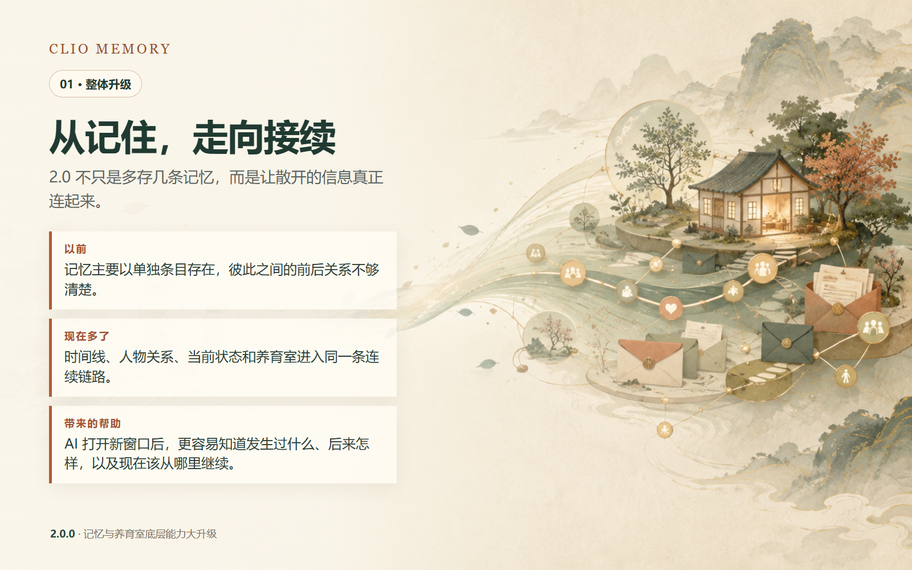

# Clio Memory 2.0

让 AI 不只是“存下一句话”，而是能沿着时间、人物关系和当下状态继续理解发生过的事。

> 当前版本：**2.0.0-rc1 发布候选版**
>
> 这是从 1.4 到 2.0 的底层能力大升级。电脑端和手机端页面目前已经可用，但完整 UI 重做尚未完成；下一版本将集中更新网页视觉与操作体验。

## 2.0 多了什么

- **连续事件摘要**：把最近六封信整理成一段有前后关系的事件摘要；相同事情只说一次，但保留后来发生的变化。
- **统一时间线**：记忆不再只是散落的条目，可以看见一件事如何开始、改变和延续。
- **人物关系记忆**：允许按人物建立主题，新的相关记忆可以自动形成关系线索。
- **关系与状态联动**：实际写入的事件会影响关系温度、当前感受和状态观察，不再只是孤立保存。
- **自我觉察候选**：从新发生的事情中形成可观察的自我认识线索，同时保留证据来源。
- **养育室**：孩子可以先自然说话；状态和照顾事件由后台另行判断，后台判断失败也不会吞掉孩子的回复。
- **更安全的照顾记录**：只有明确已经完成的喝水、吃饭、安慰等行为才会被记录；提议、疑问和计划不会被当成已经做完。
- **可回退的更正**：写错的内容可以回到写入前状态；真正随时间改变的喜好和关系则保留为时间线变化。
- **分页与边界保护**：长内容按页读取，避免一次塞入过多内容；删除、修改和后台任务保留明确边界。

完整对比见 [2.0 升级说明](RELEASE-NOTES-v2.0.md)。

## 当前界面状态

- 电脑端：可用，尚未完成 2.0 的整体视觉重做。
- 手机端：聊天输入和首页主要问题已经修复，可正常使用；其他页面仍会在下一版本统一整理。
- 这次 2.0 的重点是记忆、关系、状态和养育室底层链路，不把尚未完成的 UI 包装成成品。

## 安全说明

本仓库只包含脱敏源码和示例配置，不包含维护者的 API 密钥、密码、真实域名、服务器地址、数据库、日志、私人记忆、人物设定或聊天记录。

安装时请复制示例配置并填入你自己的值。不要把真实 `.env`、`config.yaml`、数据库或日志提交到 Git。

## 安装

需要 Python 3.11+。Docker 用户可参考 [中文安装说明](docs/INSTALL-ZH.md) 和示例配置；升级旧版本前请先备份自己的数据。

## 许可与署名

上游 Ombre-Brain 代码继续遵守 [MIT License](LICENSE)。2.0 中由 **dan521627-hash** 新增的原创代码、文档和图片按 [附加非商用许可说明](LICENSE-NONCOMMERCIAL.md) 提供。

你可以下载、研究、修改并用于个人或非商业用途。发布修改版或公开展示时，必须保留许可证、版权说明和 **dan521627-hash** 署名。商业使用需要另行取得许可。

## 参考过的仓库

- [@P0lar1zzZ/Ombre-Brain](https://github.com/P0lar1zzZ/Ombre-Brain)
- [@qimingjiu/twig-memory](https://github.com/qimingjiu/twig-memory)
- [@tianyupaipai-cmd/xinchao-nian](https://github.com/tianyupaipai-cmd/xinchao-nian)
