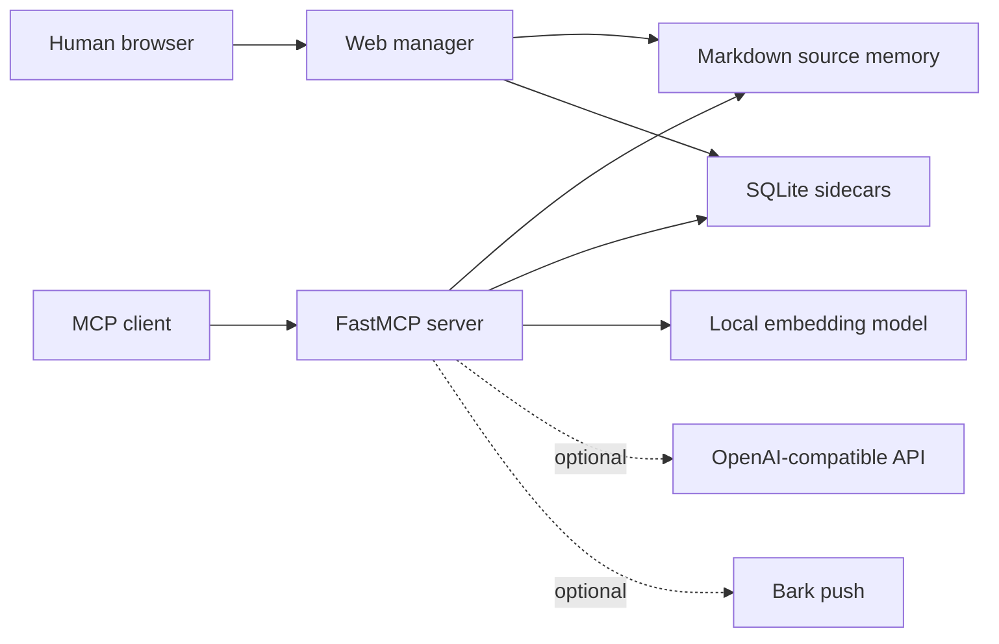

# Architecture

Markdown is the narrative source of truth. Summaries, vectors, relations, history, feedback, tasks, facts, topics, state, behavior, and treasury records live in separate SQLite sidecars. Summary generation must never overwrite Markdown source text.

Write-side services are failure-isolated: an unavailable model may delay optional extraction, but it must not turn a successful memory write into a failed write. Dangerous maintenance stays preview-first and human-confirmed.

The default deployment is local-only. Public routing, TLS, identity controls, backups, and firewall rules belong to the deployer.

